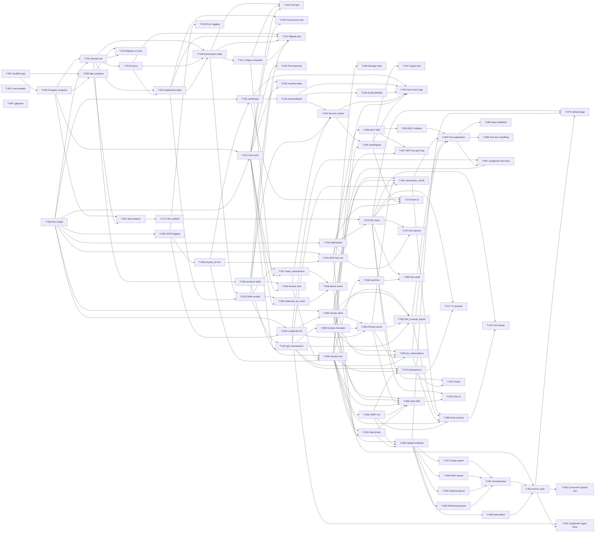

# Build Site

74 tasks across 12 tiers from 8 kits. Tasks are T-numbered sequentially across all domains and ordered by the kit dependency graph: infra → storage → auth → observability → ingestion → mcp → analytics → ui.

---

## Tier 0 — No Dependencies (Start Here)

| Task | Title | Kit | Requirement | Effort |
|------|-------|-----|-------------|--------|
| T-001 | Scaffold Python project (pyproject.toml, package layout, FastAPI/Starlette app entrypoint) | kit-infra.md | R2 | M |
| T-002 | Author `.env.example` with all required + optional vars and descriptions | kit-infra.md | R4 | S |
| T-003 | Implement env-config loader with fail-fast validation for missing required vars | kit-infra.md | R4 | M |
| T-004 | Add `.env` to `.gitignore`; ensure no real secrets are checked in | kit-infra.md | R4 | S |

---

## Tier 1 — Depends on Tier 0

| Task | Title | Kit | Requirement | blockedBy | Effort |
|------|-------|-----|-------------|-----------|--------|
| T-005 | Author `docker-compose.yml` with Postgres 16+ service, named volume, port 5432 mapping, healthcheck | kit-infra.md | R1 | T-001 | M |
| T-006 | Add app service to docker-compose: Python 3.12+ image, hot-reload via volume mount, `depends_on` Postgres healthy | kit-infra.md | R2 | T-001, T-005 | M |
| T-007 | Author `.devcontainer/devcontainer.json` extending compose, forwarding 8000 + 5432, installing Python tooling | kit-infra.md | R3 | T-005, T-006 | M |
| T-008 | Configure structured JSON logging (stdout, ISO 8601 timestamp, request_id, user_id, method, path, status, latency_ms) with `LOG_LEVEL` env var | kit-observability.md | R1 | T-003 | M |
| T-009 | Implement request_id propagation middleware (generate UUID, inject into context, include in all downstream log calls) | kit-observability.md | R1 | T-008 | M |
| T-010 | Implement error logging handler — captures unhandled exceptions, logs type/message/stack trace/request_id at ERROR level; redact tokens and raw file content | kit-observability.md | R5 | T-008 | M |

---

## Tier 2 — Depends on Tier 1

| Task | Title | Kit | Requirement | blockedBy | Effort |
|------|-------|-----|-------------|-----------|--------|
| T-011 | Initialize Alembic migration tooling and configure to read `DATABASE_URL` from env | kit-storage.md | R3 | T-005, T-003 | M |
| T-012 | Configure connection pool (SQLAlchemy async engine) with min/max size from env; use `DATABASE_URL` | kit-storage.md | R4 | T-005, T-003 | M |
| T-013 | Wire compose to run `alembic upgrade head` on app container startup; verify idempotency on already-migrated DB | kit-infra.md | R5 | T-006, T-011 | M |

---

## Tier 3 — Depends on Tier 2

| Task | Title | Kit | Requirement | blockedBy | Effort |
|------|-------|-----|-------------|-----------|--------|
| T-014 | Migration: create `source_bank` and `transaction_type` enum types | kit-storage.md | R1 | T-011 | S |
| T-015 | Migration: create `statements` table (id, filename, source_bank, file_hash UNIQUE, period_start, period_end, transaction_count, ingested_at, status, error_message) | kit-storage.md | R2 | T-011, T-014 | M |
| T-016 | Migration: create `transactions` table (full schema incl. `raw_description_hash` char(64)) with indexes on date, source_bank, category, merchant | kit-storage.md | R1 | T-011, T-014, T-015 | M |
| T-017 | Migration: add UNIQUE constraint `(source_bank, date, amount, raw_description_hash)` on transactions | kit-storage.md | R1 | T-016 | S |
| T-018 | Migration: create `sessions` table (id UUID PK, user_email, created_at, expires_at) with index on expires_at | kit-storage.md | R6 | T-011 | S |
| T-019 | Performance test: insert 1000 transactions and verify date-range query returns correct subset under 100ms | kit-storage.md | R1 | T-016, T-017, T-012 | M |
| T-020 | Concurrency test: two parallel inserts of statements with same file_hash → exactly one succeeds, other gets unique violation | kit-storage.md | R2 | T-015, T-012 | M |
| T-021 | Test: `alembic upgrade head` on empty DB produces correct schema; re-running is no-op | kit-storage.md | R3 | T-014, T-015, T-016, T-017, T-018 | S |
| T-022 | Load test: 50 concurrent requests using pool complete without exhaustion or timeout | kit-storage.md | R4 | T-012 | M |

---

## Tier 4 — Depends on Tier 3

| Task | Title | Kit | Requirement | blockedBy | Effort |
|------|-------|-----|-------------|-----------|--------|
| T-023 | Implement `Transaction` and `Statement` ORM/dataclass models matching schema | kit-storage.md | R1, R2 | T-016, T-015 | M |
| T-024 | Implement `get_transactions(start_date, end_date, bank=None, category=None)` and `get_transactions_by_merchant(...)` typed queries | kit-storage.md | R5 | T-023, T-012 | M |
| T-025 | Implement `get_monthly_totals(year, month)` aggregation query returning `Dict[category, Decimal]` | kit-storage.md | R5 | T-023, T-012 | M |
| T-026 | Implement `get_statement_by_hash(file_hash)` lookup | kit-storage.md | R5 | T-023, T-012 | M |
| T-027 | Implement `insert_transactions(statement_id, transactions)` with ON CONFLICT skip; return `(attempted, inserted)` | kit-storage.md | R5 | T-023, T-017, T-012 | M |
| T-028 | Implement atomic `insert_statement_and_transactions(statement, transactions)` — single DB transaction, returns `None` if file_hash exists else `(attempted, inserted)` | kit-storage.md | R5 | T-027, T-026 | M |
| T-029 | Test: typed exceptions raised on invalid inputs; concurrent calls to `insert_statement_and_transactions` with same file_hash → exactly one returns counts, other returns None | kit-storage.md | R5 | T-028 | M |
| T-030 | Test: insert session row → query by valid id with unexpired time returns row; expired/unknown id returns no rows | kit-storage.md | R6 | T-018, T-012 | S |

---

## Tier 5 — Depends on Tier 4

| Task | Title | Kit | Requirement | blockedBy | Effort |
|------|-------|-----|-------------|-----------|--------|
| T-031 | Implement `GET /auth/login` — generates state cookie, redirects to Google OAuth consent screen using `GOOGLE_CLIENT_ID` | kit-auth.md | R1 | T-003, T-009 | M |
| T-032 | Implement `GET /auth/callback` — validates state, exchanges code for tokens, fetches userinfo email | kit-auth.md | R1 | T-031 | M |
| T-033 | Enforce `ALLOWED_USER_EMAIL` match in callback; non-match returns 403 with clear error and no cookie issued | kit-auth.md | R2 | T-032 | S |
| T-034 | On successful callback create row in `sessions` table, set `HttpOnly; Secure; SameSite=Strict; Path=/` session cookie with `expires_at = now() + SESSION_EXPIRY_DAYS`; redirect to app root; no body payload | kit-auth.md | R3 | T-032, T-018, T-030 | M |
| T-035 | Browser session middleware — read session cookie, query sessions table for unexpired row, populate `user_email` in context, return 401 on missing/invalid; bypass entirely when `DISABLE_AUTH=true` (treat as `ALLOWED_USER_EMAIL`) | kit-auth.md | R4 | T-018, T-030, T-009 | M |
| T-036 | `POST /auth/logout` — delete session row, clear cookie via `Set-Cookie` with expired Max-Age | kit-auth.md | R5 | T-034, T-035 | M |
| T-037 | Test: session valid before logout; same cookie rejected after logout even if server restarts between calls | kit-auth.md | R5 | T-036 | S |
| T-038 | CSRF middleware — set non-HttpOnly CSRF cookie on auth, validate `X-CSRF-Token` header matches cookie on POST routes; exempt GET + OAuth flow; bypass when `DISABLE_AUTH=true` | kit-auth.md | R6 | T-035 | M |
| T-039 | `GET /auth/me` — return `{ email }` from active session; 401 if none | kit-auth.md | R7 | T-035 | S |
| T-040 | `GET /auth/status` — return `{ auth_enabled: boolean }` derived from `DISABLE_AUTH` | kit-ui.md | R2 | T-003 | S |
| T-041 | MCP API key middleware — validate `Authorization: Bearer <MCP_API_KEY>` on `/sse` and `/messages`; 401 on missing/invalid; bypass when `DISABLE_AUTH=true` | kit-auth.md | R8 | T-003, T-009 | M |
| T-042 | Auth event logging — emit structured log entries for login success, login 403 (wrong email), logout, 401, 403 (no PII in token fields) | kit-auth.md | R2, R5; kit-observability.md R5 | T-031, T-032, T-033, T-034, T-035, T-036 | S |

---

## Tier 6 — Depends on Tier 5

| Task | Title | Kit | Requirement | blockedBy | Effort |
|------|-------|-----|-------------|-----------|--------|
| T-043 | Per-client sliding-window rate limiter — key = session id (browser) or MCP API key (MCP); default 60 req/min, configurable via env; emits `X-RateLimit-Limit/Remaining/Reset`; returns 429 with `Retry-After` on excess | kit-observability.md | R2 | T-035, T-041 | M |
| T-044 | Initialize LangSmith client wrapper — reads `LANGSMITH_API_KEY` and `LANGSMITH_PROJECT`; gracefully no-ops with warning when key absent | kit-observability.md | R3, R4 | T-003, T-008 | M |

---

## Tier 7 — Depends on Tier 6 (Ingestion + MCP scaffolding)

| Task | Title | Kit | Requirement | blockedBy | Effort |
|------|-------|-----|-------------|-----------|--------|
| T-045 | `POST /upload` endpoint — multipart accept, optional `bank` field, validates content-type (PDF/CSV) returning 400 otherwise; protected by session middleware + CSRF | kit-ingestion.md | R1 | T-035, T-038, T-043 | M |
| T-046 | Bank auto-detection — CSV header sniffing + PDF first-page text scan for chase/amex/capital_one/robinhood; falls back to requiring explicit `bank` if ambiguous | kit-ingestion.md | R2 | T-045 | M |
| T-047 | Chase parser — handle checking + credit card CSV variants; map Date/Description/Amount/Category; signs preserved (negative = debit) | kit-ingestion.md | R3 | T-045 | M |
| T-048 | Amex parser — CSV (Date/Description/Amount with negative=charge) and PDF tabular extraction; merchant from description | kit-ingestion.md | R4 | T-045 | L |
| T-049 | Capital One parser — handle separate Debit/Credit columns; compute `amount = Credit − Debit` (positive = credit) | kit-ingestion.md | R5 | T-045 | M |
| T-050 | Robinhood parser — CSV only; filter to deposits/withdrawals/dividends; skip equity trades; map credit/debit to transaction_type | kit-ingestion.md | R6 | T-045 | M |
| T-051 | Transaction normalization — ISO 8601 dates, positive amount + transaction_type direction, description trim/control-char strip, merchant heuristic, intra-upload dedup on (date, amount, description) | kit-ingestion.md | R7 | T-047, T-048, T-049, T-050 | M |
| T-052 | Hash + atomic write — compute `file_hash` (SHA-256 of file) and `raw_description_hash` per row; call `insert_statement_and_transactions`; on `None` return 409; on counts return 200 with `{ statement_id, bank_detected, transaction_count, duplicates_skipped, period_start, period_end }` | kit-ingestion.md | R8 | T-028, T-051, T-046 | M |
| T-053 | Concurrency test: two clients upload identical file simultaneously → one 200, one 409; DB has exactly one statement, no duplicate transactions | kit-ingestion.md | R8 | T-052 | M |
| T-054 | LangSmith ingestion pipeline tracing — single parent run per upload with spans for parse, normalize, dedup-check, DB write; attributes `source_bank`, `filename`, `transaction_count`, `duration_ms`; failed ingestion records error status + exception | kit-observability.md | R4 | T-044, T-052 | M |
| T-055 | MCP SSE transport — `GET /sse` streaming and `POST /messages` endpoints implementing MCP 2024-11-05; supports concurrent clients | kit-mcp.md | R1 | T-041 | L |
| T-056 | MCP `initialize` handshake — server name `financial-hygiene-assistant`, version from package metadata, capabilities `tools` only | kit-mcp.md | R6 | T-055 | S |
| T-057 | MCP API key validated on every `POST /messages` request (not just SSE connect); 401 before stream established when missing on `/sse` | kit-mcp.md | R4 | T-055, T-041 | S |

---

## Tier 8 — Depends on Tier 7 (Analytics core)

| Task | Title | Kit | Requirement | blockedBy | Effort |
|------|-------|-----|-------------|-----------|--------|
| T-058 | Transaction context formatter — compact CSV serialization (`date,description,amount,type,category` header), plain decimals, truncate to default 2000 most recent if over budget, log warning when nearing limit; estimate token count | kit-analytics.md | R4 | T-024 | M |
| T-059 | Anthropic Claude API client wrapper — model `claude-sonnet-4-6` (override via `ANTHROPIC_MODEL`), max_tokens 1024 (configurable), system prompt establishing finance analyst role; map API errors (rate-limit/timeout/invalid key) to typed errors with retry guidance | kit-analytics.md | R5 | T-003, T-044 | M |
| T-060 | Prompt caching — place cache breakpoint after system prompt + transaction context block; surface cache hit rate via LangSmith span attributes | kit-analytics.md | R6 | T-059, T-058, T-044 | M |
| T-061 | `summarize_month(month, include_categories=true)` analytics function — fetch month's transactions, format via T-058, prompt Claude for totals/category breakdown/top-5 merchants/observations; error if no transactions | kit-analytics.md | R1 | T-058, T-059, T-060, T-024 | M |
| T-062 | `find_unusual_spend(month, lookback_months=3, max=12)` analytics function — fetch month + lookback transactions, ask Claude to identify outliers; "no unusual spend detected" when nothing notable (not error) | kit-analytics.md | R2 | T-058, T-059, T-060, T-024 | M |
| T-063 | `list_recurring_subscriptions(lookback_months=6, max=24)` analytics function — fetch transactions, prompt Claude for recurring patterns; output structured list (merchant, frequency, estimated amount, last charged); exclude mortgage/rent/utility merchants via heuristic context | kit-analytics.md | R3 | T-058, T-059, T-060, T-024 | M |

---

## Tier 9 — Depends on Tier 8 (MCP tools + chat endpoint)

| Task | Title | Kit | Requirement | blockedBy | Effort |
|------|-------|-----|-------------|-----------|--------|
| T-064 | Register MCP tools (`summarize_month`, `find_unusual_spend`, `list_recurring_subscriptions`) with name, description, JSON Schema; verify `tools/list` returns all three | kit-mcp.md | R2 | T-056, T-061, T-062, T-063 | M |
| T-065 | Tool input validation — JSON Schema validated before handler invoked; missing/invalid params return MCP `isError: true` with field-specific human-readable message (no 500) | kit-mcp.md | R3 | T-064 | M |
| T-066 | Tool error handling — wrap handlers; exceptions become `isError: true` MCP responses; stack trace logged server-side, not exposed to client | kit-mcp.md | R5 | T-064 | S |
| T-067 | LangSmith MCP tool tracing — each tool invocation creates run with name/args/output/latency/token count; Claude API calls are child spans; works disabled when `LANGSMITH_API_KEY` unset | kit-observability.md | R3 | T-044, T-064, T-059 | M |
| T-068 | `POST /chat` SSE endpoint — accepts `{ question, context_months=3, history }`, fetches transactions, formats as compact CSV (R4 reuse), keeps last 6 history turns, streams Claude tokens as `text/event-stream`; protected by session cookie + CSRF middleware; prompt caching on system+context block | kit-analytics.md | R7 | T-058, T-059, T-060, T-035, T-038, T-043 | L |
| T-069 | HTTP proxy endpoints `POST /tools/summarize_month`, `POST /tools/find_unusual_spend`, `POST /tools/list_recurring_subscriptions` — call same analytics functions, return text or structured JSON for subscriptions; protected by session cookie + CSRF | kit-ui.md | R4 (UI HTTP endpoints section) | T-061, T-062, T-063, T-035, T-038 | M |
| T-070 | `GET /transactions` paginated list endpoint — accepts date-range, bank (multi), category (multi), type filters; returns 100 rows/page with pagination metadata | kit-ui.md | R5 (UI HTTP endpoints) | T-024, T-035, T-038 | M |

---

## Tier 10 — Depends on Tier 9 (Frontend foundation)

| Task | Title | Kit | Requirement | blockedBy | Effort |
|------|-------|-----|-------------|-----------|--------|
| T-071 | Scaffold React + Vite SPA in `frontend/`; add `frontend/` service to docker-compose; forward Vite port 5173 in devcontainer.json | kit-ui.md | R8; kit-infra.md R3 | T-007 | M |
| T-072 | Typed API client module — wraps all fetch calls with `credentials: 'include'`; reads CSRF cookie value and attaches `X-CSRF-Token` header on POST; on 401 redirects to login; toast on network error; no raw fetch outside module | kit-ui.md | R9 | T-071, T-040 | M |
| T-073 | Auth flow UI — login page with "Sign in with Google" button → redirects to `GET /auth/login`; on app load reads `GET /auth/status` to skip login when disabled; "Sign out" calls `POST /auth/logout` and redirects to login; no localStorage of identity | kit-ui.md | R1 | T-072, T-031, T-036, T-040 | M |
| T-074 | Auth bypass dev banner — when `auth_enabled` is false, persistent yellow banner "Auth disabled — dev mode" shown on all pages, not dismissable | kit-ui.md | R2 | T-072, T-040 | S |

---

## Tier 11 — Depends on Tier 10 (Feature pages)

| Task | Title | Kit | Requirement | blockedBy | Effort |
|------|-------|-----|-------------|-----------|--------|
| T-075 | Statement Upload page — drag-and-drop zone + click-to-browse, bank dropdown (auto-detect default + 4 banks), indeterminate spinner; success card with `{ bank_detected, transaction_count, period_start, period_end }`; 409 → "Already ingested" with original date; 400 → validation message; sequential single-file uploads | kit-ui.md | R3 | T-072, T-045, T-052 | L |
| T-076 | Tool Output Viewer — three tabs/cards: Month Summary (month picker, markdown render), Unusual Spend (month + lookback selector, markdown), Subscriptions (lookback selector, structured list); loading + error states | kit-ui.md | R4 | T-072, T-069 | L |
| T-077 | Transaction Browser — table (Date, Description, Merchant, Amount, Type, Category, Bank); date range, bank multi-select, category multi-select, type toggle filters; client-side full-text search on Description+Merchant; pagination 100/page; debit red/credit green; CSV export of filtered view | kit-ui.md | R5 | T-072, T-070 | L |
| T-078 | Spend Visualizations — pie/donut for category breakdown; bar chart monthly trend last 6 months; horizontal bar top 10 merchants; shared month selector with Tool Output Viewer; render under 500ms from pre-fetched data | kit-ui.md | R6 | T-072, T-070 | L |
| T-079 | Natural Language Chat — bottom input box, scrolling history, calls `POST /chat`, renders streamed markdown bubbles, "Clear history" button, last 6 turns sent with each request, history persists in browser session only | kit-ui.md | R7 | T-072, T-068 | L |
| T-080 | Navigation/layout shell — sidebar or top nav (Upload, Summary, Transactions, Chat) with active route highlight; user email in header from `GET /auth/me`; client-side routing without reload; responsive ≥1024px | kit-ui.md | R8 | T-072, T-039 | M |

---

## Summary

| Tier | Tasks | Effort |
|------|-------|--------|
| 0 | 4 | 1S, 3M |
| 1 | 6 | 0S, 6M |
| 2 | 3 | 0S, 3M |
| 3 | 9 | 4S, 5M |
| 4 | 8 | 1S, 7M |
| 5 | 12 | 4S, 8M |
| 6 | 2 | 0S, 2M |
| 7 | 13 | 1S, 11M, 1L |
| 8 | 6 | 0S, 6M |
| 9 | 7 | 1S, 5M, 1L |
| 10 | 4 | 1S, 3M |
| 11 | 6 | 0S, 1M, 5L |

**Total: 80 tasks, 12 tiers** (12S, 60M, 7L; ~7 size-L, the rest M-or-smaller)

> Note: numbering reaches T-080 because some requirements decomposed into multiple tasks (e.g. R4/R5 in storage, R1/R3 in auth, R8 in ingestion). Coverage matrix below confirms 100% acceptance-criterion coverage.

---

## Coverage Matrix

Every acceptance criterion in every kit, mapped to the task(s) that validate it.

### kit-infra.md

| Kit | Req | Criterion (abbreviated) | Task(s) | Status |
|-----|-----|-------------------------|---------|--------|
| infra | R1 | `docker compose up -d` starts Postgres; psql connects on localhost:5432 | T-005 | COVERED |
| infra | R2 | `docker compose up` starts both containers; server responds to HTTP | T-006, T-001 | COVERED |
| infra | R3 | "Reopen in Container" produces working dev environment | T-007 | COVERED |
| infra | R4 | Server fails fast with clear error if any required var missing | T-002, T-003, T-004 | COVERED |
| infra | R5 | Fresh `docker compose up` on empty volume produces fully-migrated DB | T-013, T-021 | COVERED |

### kit-storage.md

| Kit | Req | Criterion (abbreviated) | Task(s) | Status |
|-----|-----|-------------------------|---------|--------|
| storage | R1 | Insert 1000 transactions; date-range query <100ms | T-019 | COVERED |
| storage | R1 | Duplicate (source_bank, date, amount, raw_description_hash) rejected at DB | T-017, T-029 | COVERED |
| storage | R2 | Re-upload detectable via `file_hash` lookup | T-015, T-026 | COVERED |
| storage | R2 | Concurrent inserts of same `file_hash` → exactly one succeeds | T-020 | COVERED |
| storage | R3 | `migrate up` empty DB correct schema; re-run no-op | T-021 | COVERED |
| storage | R4 | 50 concurrent requests complete without exhaustion/timeout | T-022 | COVERED |
| storage | R5 | Each query function correct types; invalid inputs raise typed exceptions | T-024, T-025, T-026, T-027, T-029 | COVERED |
| storage | R5 | Concurrent `insert_statement_and_transactions` with same hash → one counts, other None | T-028, T-029 | COVERED |
| storage | R6 | Insert session row; valid id+unexpired returns row; expired/unknown returns none | T-018, T-030 | COVERED |

### kit-auth.md

| Kit | Req | Criterion (abbreviated) | Task(s) | Status |
|-----|-----|-------------------------|---------|--------|
| auth | R1 | Browser hits `/auth/login` → completes Google sign-in → success page | T-031, T-032, T-034 | COVERED |
| auth | R2 | Wrong account → 403; correct account succeeds | T-033 | COVERED |
| auth | R3 | After OAuth login, browser has session cookie; no credential in body or JS | T-034 | COVERED |
| auth | R4 | No cookie → 401 on /upload; valid cookie proceeds; `DISABLE_AUTH=true` skips check | T-035 | COVERED |
| auth | R5 | Session valid before logout; same cookie rejected after, even across server restart | T-036, T-037 | COVERED |
| auth | R6 | POST /upload without `X-CSRF-Token` → 403; with matching header proceeds | T-038 | COVERED |
| auth | R7 | Authenticated → `GET /auth/me` returns email; unauthenticated → 401 | T-039 | COVERED |
| auth | R8 | `/sse` with correct `MCP_API_KEY` connects; wrong key → 401 | T-041, T-057 | COVERED |

### kit-observability.md

| Kit | Req | Criterion (abbreviated) | Task(s) | Status |
|-----|-----|-------------------------|---------|--------|
| observability | R1 | curl any endpoint → log line with all required fields incl. accurate `latency_ms` | T-008, T-009 | COVERED |
| observability | R2 | 61st request within 60s → 429; first request next window succeeds | T-043 | COVERED |
| observability | R3 | `summarize_month` via MCP creates visible LangSmith trace | T-044, T-067 | COVERED |
| observability | R4 | Uploading statement creates multi-span LangSmith trace | T-054 | COVERED |
| observability | R5 | 500 produces log entry with stack trace; no token values visible | T-010, T-042 | COVERED |

### kit-ingestion.md

| Kit | Req | Criterion (abbreviated) | Task(s) | Status |
|-----|-----|-------------------------|---------|--------|
| ingestion | R1 | Upload Chase CSV → response has correct bank, count, period | T-045, T-052, T-047 | COVERED |
| ingestion | R2 | Upload Chase CSV without `bank` → detected as `chase` | T-046 | COVERED |
| ingestion | R3 | Parse Chase CSV → all transactions extracted with correct signs/dates | T-047 | COVERED |
| ingestion | R4 | Parse Amex statement → transactions match manual count | T-048 | COVERED |
| ingestion | R5 | Parse CapOne CSV → debits negative, credits positive | T-049 | COVERED |
| ingestion | R6 | Parse Robinhood CSV → only cash-flow rows, equity trades excluded | T-050 | COVERED |
| ingestion | R7 | Two identical rows in one CSV → only one transaction stored | T-051 | COVERED |
| ingestion | R8 | Concurrent identical uploads → one 200, one 409; DB has one statement, no dup tx | T-052, T-053 | COVERED |

### kit-mcp.md

| Kit | Req | Criterion (abbreviated) | Task(s) | Status |
|-----|-----|-------------------------|---------|--------|
| mcp | R1 | MCP client connects and lists available tools | T-055, T-064 | COVERED |
| mcp | R2 | `tools/list` returns all 3 tools with correct schemas | T-064 | COVERED |
| mcp | R3 | Call `summarize_month` without required `month` → error response, not 500 | T-065 | COVERED |
| mcp | R4 | Connect without key → 401; correct MCP_API_KEY connects | T-041, T-057 | COVERED |
| mcp | R5 | Tool that throws → MCP error response with actionable message | T-066 | COVERED |
| mcp | R6 | `initialize` returns correct name, version, capabilities | T-056 | COVERED |

### kit-analytics.md

| Kit | Req | Criterion (abbreviated) | Task(s) | Status |
|-----|-----|-------------------------|---------|--------|
| analytics | R1 | Call with month with data → response has spend total + category breakdown | T-061 | COVERED |
| analytics | R2 | $2000 charge in a month → tool flags as unusual vs prior months | T-062 | COVERED |
| analytics | R3 | Three months with "Netflix $15.49" → listed as monthly subscription | T-063 | COVERED |
| analytics | R4 | 1000 transactions formatted and passed to Claude without API error | T-058 | COVERED |
| analytics | R5 | Valid API key → tool returns Claude's response; invalid key → MCP error with clear message | T-059, T-066 | COVERED |
| analytics | R6 | Second call with same month data has lower token count (cache hit) | T-060 | COVERED |
| analytics | R7 | `POST /chat` with question about last month → SSE markdown answer referencing real txns | T-068 | COVERED |

### kit-ui.md

| Kit | Req | Criterion (abbreviated) | Task(s) | Status |
|-----|-----|-------------------------|---------|--------|
| ui | R1 | Full browser login flow; subsequent API calls succeed; logout invalidates; no JS-visible credential | T-073, T-072 | COVERED |
| ui | R2 | `DISABLE_AUTH=true` → login skipped, banner visible on all pages | T-074, T-040 | COVERED |
| ui | R3 | Drag CSV onto zone, select bank, submit → success card with transaction count | T-075 | COVERED |
| ui | R4 | Select month with data → summary renders with category breakdown | T-076, T-069 | COVERED |
| ui | R5 | Filter Chase + last 30 days → only Chase txns shown; export valid CSV | T-077, T-070 | COVERED |
| ui | R6 | Select month → three charts render with correct totals matching txn data | T-078 | COVERED |
| ui | R7 | "What's my biggest expense category?" → streamed markdown answer with real data | T-079, T-068 | COVERED |
| ui | R8 | Navigating between sections works without reload; active section highlighted | T-080 | COVERED |
| ui | R9 | Valid session → calls succeed; 401 → redirect to login; POST includes CSRF header | T-072 | COVERED |

**Coverage: 53/53 criteria (100%)**

---

## Dependency Graph

